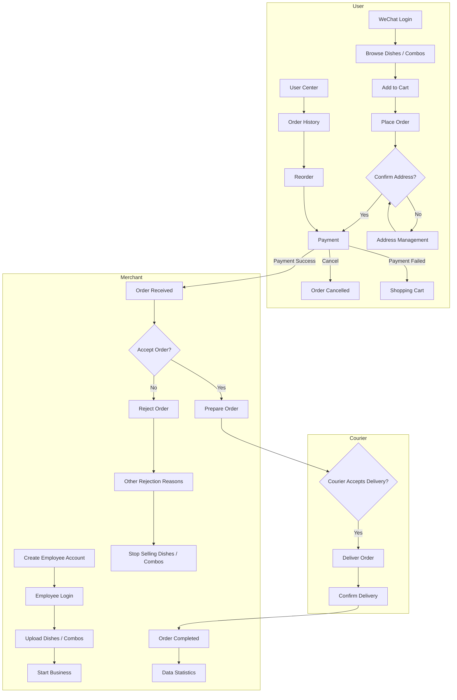
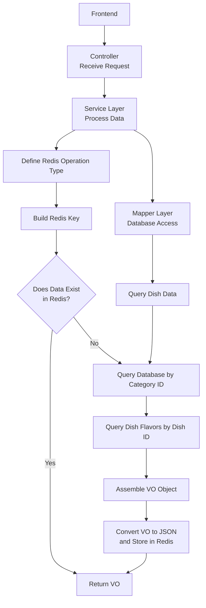

# Sky Takeout (苍穹外卖)

A comprehensive food delivery and takeout management system that provides a complete solution for restaurant operations, including customer-facing mobile application, administrative dashboard, and backend services.

## Project Overview

Sky Takeout is a full-stack food delivery platform that enables restaurants to manage their operations efficiently while providing customers with a seamless ordering experience. The system consists of three main components:

1. **WeChat Mini Program** - Customer-facing mobile application
2. **Admin Dashboard** - Restaurant management web interface
3. **Backend API** - RESTful services for business logic

Here shows the diagram of this project

## Core Features

### Customer Features (WeChat Mini Program)
- **User Authentication** - WeChat login integration
- **Menu Browsing** - Browse dishes and setmeals by category
- **Shopping Cart** - Add, modify, and manage items in cart
- **Order Management** - Place orders, view order history, track order status
- **Payment Integration** - WeChat Pay payment processing
- **Address Management** - Add, edit, and manage delivery addresses
- **Order Details** - View detailed order information and status

### Admin Features
- **Employee Management** - Add, edit, enable/disable employee accounts
- **Category Management** - Organize dishes into categories
- **Dish Management** - Create, update, and manage dishes with flavors
- **Setmeal Management** - Create and manage meal packages
- **Order Management** - Process orders, update order status, handle cancellations
- **Shop Management** - Configure shop information and business hours

## Services Implemented

### User Services
- **User Service** - User registration, login, and profile management
- **Address Book Service** - Delivery address CRUD operations
- **Shopping Cart Service** - Cart item management
- **Order Service** - Order creation, payment processing, status tracking

### Admin Services
- **Employee Service** - Employee account management and authentication
- **Category Service** - Category management with hierarchical structure
- **Dish Service** - Dish management with flavor options and image upload
- **Setmeal Service** - Setmeal creation and management
- **Order Service** - Order processing, status updates, and statistics
- **Shop Service** - Shop configuration and status management
- **Workspace Service** - Business data analytics and reporting

### Common Services
- **File Upload Service** - Image and file upload to cloud storage (AWS S3)
- **Payment Service** - WeChat Pay integration for order payments
- **Notification Service** - Order status notifications

## Technology Stack

<table><tr><td valign="top" width="33%">

### Backend Development  

  
  
  
  
  

</td><td valign="top" width="33%">

### Frontend Development  

  
  
  

</td><td valign="top" width="33%">

### Tools & Infrastructure  

  
  
 
  

  

</td></tr></table>

## Project Diagram
### User Query Dishes with redis for caching

## TODO List

### Order Management Service

- [ ] Implement order pagination query
- [ ] Implement order details query
- [ ] Implement order status update
- [ ] Implement order confirmation
- [ ] Implement order rejection
- [ ] Implement order cancellation
- [ ] Implement order delivery
- [ ] Implement order completion
- [ ] Implement user order history
- [ ] Implement order statistics

### Payment Service

- [ ] Implement payment processing
- [ ] Implement payment callback handler
- [ ] Implement payment status query
- [ ] Implement refund functionality
- [ ] Add payment methods to OrderService interface
- [ ] Add payment endpoints to User OrderController

### Order Dashboard Service

- [ ] Complete getOverviewOrders method
- [ ] Complete getBusinessData method
- [ ] Add order statistics method
- [ ] Add order trend analysis method
- [ ] Create WorkspaceServiceImpl
- [ ] Create WorkspaceController

### Controllers

- [ ] Create Admin OrderController
- [ ] Add order statistics endpoint
- [ ] Enhance User OrderController with history and detail endpoints

### Data Access Layer

- [ ] Enhance OrderMapper methods
- [ ] Enhance OrderDetailMapper methods

### DTOs/VOs

- [ ] Create order DTOs (Confirm, Rejection, Cancel, Delivery)
- [ ] Create order VOs (Statistics, Detail)

### Testing

- [ ] Test order management flow
- [ ] Test payment functionality
- [ ] Test dashboard services
