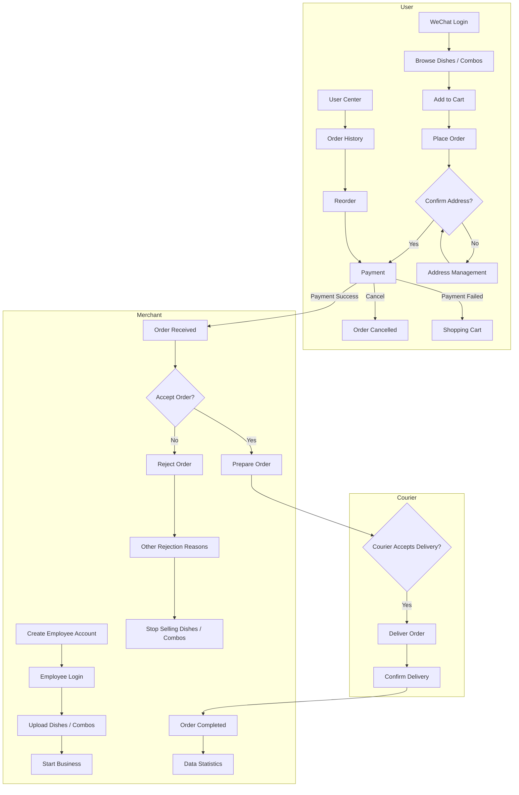
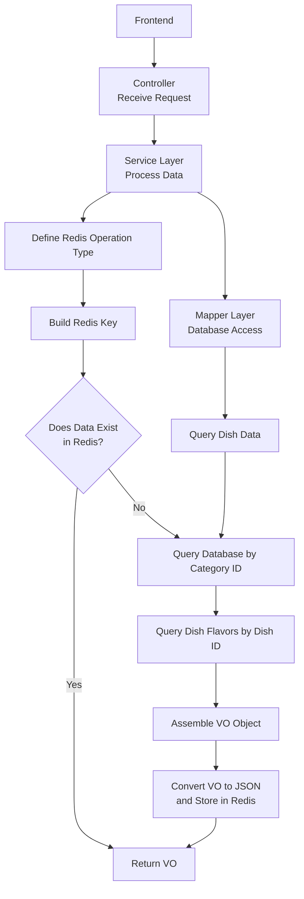

# Sky Take-Out

A full-stack food delivery and takeout management platform. It gives restaurants an end-to-end solution for running their operations — a customer-facing WeChat Mini Program, an administrative web dashboard, and a RESTful backend that powers both.

---

## Table of Contents

- [Overview](#overview)
- [Architecture](#architecture)
- [Tech Stack](#tech-stack)
- [Project Structure](#project-structure)
- [Features](#features)
- [Getting Started](#getting-started)
  - [Prerequisites](#prerequisites)
  - [1. Database](#1-database)
  - [2. Backend (Spring Boot)](#2-backend-spring-boot)
  - [3. Admin Dashboard (Vue)](#3-admin-dashboard-vue)
  - [4. WeChat Mini Program](#4-wechat-mini-program)
- [Configuration & Secrets](#configuration--secrets)
- [API Documentation](#api-documentation)
- [Caching Strategy](#caching-strategy)
- [Roadmap](#roadmap)
- [License](#license)

---

## Overview

Sky Take-Out is a complete ordering and fulfillment system. Customers browse the menu, build a cart, place and pay for orders, and track delivery from a WeChat Mini Program. Staff manage dishes, set meals, employees, and the full order lifecycle from a web dashboard, while the backend exposes a clean REST API consumed by both clients.

The system is organized around three actors:

| Actor | Client | Responsibilities |
|-------|--------|------------------|
| **Customer** | WeChat Mini Program | Browse menu, manage cart & addresses, place/pay orders, view history |
| **Merchant / Staff** | Admin Dashboard | Manage employees, categories, dishes, set meals, orders, shop status, analytics |
| **Courier** | (delivery flow) | Accept and confirm delivery of prepared orders |

## Architecture



## Tech Stack

**Backend**
- Java + Spring Boot 2.7.3
- MyBatis (XML mappers) + PageHelper for pagination
- MySQL (persistence) · Redis (caching & session)
- Druid connection pool
- JWT for authentication (separate admin / user tokens)
- AWS S3 for image & file storage
- Apache POI for Excel report export
- Knife4j (Swagger / OpenAPI) for API documentation

**Admin Dashboard**
- Vue 2 + TypeScript
- Element UI component library
- Vuex (state) · Vue Router · Axios
- ECharts for analytics charts
- Built with Vue CLI

**Customer App**
- WeChat Mini Program (uni-app based)

**Infrastructure & Tooling**
- Nginx (reverse proxy / static hosting — `nginx-1.20.2/` bundled)
- Maven (multi-module build)
- Git

## Project Structure

```
sky-take-out/
├── sky-take-out/                 # Backend — Maven multi-module project
│   ├── sky-common/               #   Shared utilities, constants, exceptions, result wrappers
│   ├── sky-pojo/                 #   Entities, DTOs, VOs
│   └── sky-server/               #   Controllers, services, mappers, config (Spring Boot app)
├── project-rjwm-admin-vue-ts/    # Admin dashboard (Vue 2 + TypeScript)
├── mp-weixin/                    # WeChat Mini Program (customer-facing)
└── nginx-1.20.2/                 # Bundled Nginx for local reverse proxy
```

## Features

### Customer (WeChat Mini Program)
- WeChat login & authentication
- Browse dishes and set meals by category
- Shopping cart: add, update quantity, clear
- Place orders, repeat past orders, track status
- WeChat Pay integration
- Delivery address management

### Admin Dashboard
- **Employee management** — create, edit, enable/disable accounts
- **Category management** — organize dishes and set meals
- **Dish management** — CRUD with flavor options and image upload
- **Set meal management** — bundle dishes into combos
- **Order management** — accept, reject, dispatch, complete, and cancel orders
- **Shop management** — toggle business status and configuration
- **Analytics** — revenue, order, and customer statistics with Excel export

## Getting Started

### Prerequisites

- JDK 8 or 11
- Maven 3.6+
- MySQL 5.7+ / 8.x
- Redis 5+
- Node.js (for the admin dashboard build)
- WeChat Developer Tools (for the Mini Program)
- An AWS S3 bucket and a WeChat Mini Program account (for image upload and login)

### 1. Database

Create the database and import the schema/seed data:

```sql
CREATE DATABASE sky_take_out CHARACTER SET utf8mb4;
```

> Import the project's SQL script into the `sky_take_out` database before starting the backend.

### 2. Backend (Spring Boot)

```bash
cd sky-take-out
mvn clean package -DskipTests
java -jar sky-server/target/sky-server-1.0-SNAPSHOT.jar
```

Or run `SkyApplication` directly from your IDE. The server listens on **port 8080** by default.

Configure your local secrets in `sky-server/src/main/resources/application-dev.yml` (see [Configuration & Secrets](#configuration--secrets)).

### 3. Admin Dashboard (Vue)

```bash
cd project-rjwm-admin-vue-ts
npm install
npm run serve        # development
npm run build        # production build
```

### 4. WeChat Mini Program

Open the `mp-weixin/` directory in **WeChat Developer Tools**, set your own AppID in `project.config.json`, and run it against a backend reachable from the simulator.

## Configuration & Secrets

The backend reads all sensitive values from `application-dev.yml`, which feeds into `application.yml` via placeholders. The following must be provided:

| Group | Keys |
|-------|------|
| `sky.datasource` | `host`, `port`, `database`, `username`, `password` |
| `sky.redis` | `host`, `port`, `password`, `database` |
| `sky.awsoss` | `access-key-id`, `access-key-secret`, `bucket-name`, `endpoint`, `region` |
| `sky.wechat` | `appid`, `secret` |

> [!WARNING]
> **Never commit real credentials.** Keep `application-dev.yml` out of version control (or commit it with placeholder values only) and supply real secrets via environment variables or an untracked local file. The default JWT signing keys in `application.yml` should also be changed before any deployment.

## API Documentation

With the backend running, the Knife4j (Swagger) UI is available at:

```
http://localhost:8080/doc.html
```

## Caching Strategy

Dish queries are cached in Redis to reduce database load. The flow on a customer menu request:



When dishes are created, updated, or have their sale status changed from the admin side, the corresponding cache entries are evicted to keep the menu consistent.

## Roadmap

- [ ] WebSocket-based real-time order notifications for merchants
- [ ] More detailed sales and customer analytics
- [ ] Coupon and promotion system
- [ ] Automated test coverage for the order and payment flows

## License

This project is intended for learning and demonstration purposes.
